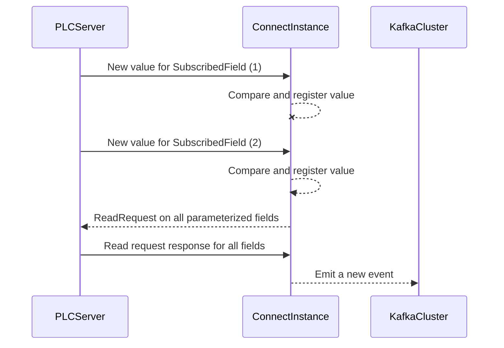

# PLCSubscriptionSourceConnector

This component is **Kafka Connect Source Connector** created to interface OPCUA PLC servers with Kafka Clusters.

It's main goal is to subscribe to specific exposed data fields (aka **subscription fields**)  and create some custom events when thoses subscription fields value changes.

# Configuration

## General parameters

| Parameter | Usage | Value|
|--|--|--|
| connector.class | Define the connector to instanciate | **must be** "com.cgi.connect.PLCSubscriptionSourceConnector" |
| plc.connection.string | Connection string to PLC server | ex : "opcua:tcp://opcserver:62541/Quickstarts/ReferenceServer" |
| transforms | declare a Kafka Connect SMT | "SetSchemaName" |
| transforms.SetSchemaName.type | Define a Kafka Connect SMT to name the output avro schema | "org.apache.kafka.connect.transforms.SetSchemaMetadata$Value" |
| transforms.SetSchemaName.schema.name | output Avro Schema Name | ex : "io.your.namespace.YourAvroModel" |
| tasks.max | Number of instanciated task for this connector, currently limited to 1 | **must be** "1" |
| name | Name of the configurated connector | YourConnectorName |
| plc.poll.interval | time in milliseconds between each poll | ex : "10000" |

## Subscription fields

This section describe how to declare the field to monitor change on, it could be (for example) any incrementing data in your PLC data model.

| Parameter | Usage | Value|
|--|--|--|
| plc.subscriptions | Comma-separated list of subscription managed by this connector | ex : "subscription1,subscription2,subscription3" |
| plc.subscriptions.**yoursubscription**.path | PLC Address of the subscribed field, one configuration line for each subscription declared earlier | ex : "ns=2;s=AField_1:STRING" |

## Output Avro Event Field Declaration

This section describe output event structure.

> Current version only support STRING & FLOAT datatypes

- Simple field declaration

| Parameter | Usage | Value|
|--|--|--|
| plc.output.key| Comma-separated list of fields to be used to composed the event key | ex : field1,field2 |
| plc.output.fields.**fieldName**.type | One line per field,  | "FLOAT" or "STRING" |

 - Subfield should be be describe like this :

| Parameter | Usage | Value|
|--|--|--|
| plc.output.fields.**parentField**.**fieldName**.type | One line per field,  | "FLOAT" or "STRING" |
| plc.output.fields.**parentField**.**subParentField**.**fieldName**.type | One line per field,  | "FLOAT" or "STRING" |

> All final field name must be uniques

## Mapping between subscription field and output avro model

| Parameter | Usage | Value|
|--|--|--|
| plc.mappings.**subscriptionField**.**fieldName**.path | Comma-separated list of fields to be used to composed the event key | ex : field1,field2 |
| plc.output.fields.**fieldName**.type | One line per field,  | "FLOAT" or "STRING" |

> If you have multiple subscription fields you **must** define a mapping for all fields for all subscriptions

## Data flow inside connector

Here's a simple flow description :

# Full configuration file example

    {  
      "connector.class": "com.cgi.connect.PLCSubscriptionSourceConnector",  
      "plc.connection.string": "opcua:tcp://opcserver:62541/Quickstarts/ReferenceServer",  
      "transforms.SetSchemaName.schema.name": "io.demo.avro.PlcEvent",  
      "transforms.SetSchemaName.type": "org.apache.kafka.connect.transforms.SetSchemaMetadata$Value",  
      "tasks.max": "1",  
      "transforms": "SetSchemaName",  
      "topic": "PLCEvent_Demo_Avro",  
      "name": "Demo_PLC_Subscription_Source",  
      "key.converter": "org.apache.kafka.connect.storage.StringConverter",  
      "plc.subscriptions":"machine1,machine2,machine3",  
	  "plc.poll.interval":"10000",  
      
      "plc.subscriptions.machine1.path":"ns=2;s=Fabrication_Id_1:STRING",  
      "plc.subscriptions.machine2.path":"ns=2;s=Fabrication_Id_2:STRING",  
      "plc.subscriptions.machine3.path":"ns=2;s=Fabrication_Id_3:STRING",  
      
      "plc.output.key":"id,fabricationId",  
      "plc.output.fields.id":"STRING",  
      "plc.output.fields.date":"STRING",  
      "plc.output.fields.fabricationId":"STRING",  
      "plc.output.fields.weight":"STRING",  
      "plc.output.fields.operation.mixing.mixingDuration":"FLOAT",  
      "plc.output.fields.operation.curing.curingDuration":"FLOAT",  
      
      "plc.mappings.machine1.id.path":"ns=2;s=Id_1:STRING",  
      "plc.mappings.machine1.date.path":"ns=2;s=Fabrication_Date_1:STRING",  
      "plc.mappings.machine1.fabricationId.path":"ns=2;s=Fabrication_Id_1:STRING",  
      "plc.mappings.machine1.weight.path":"ns=2;s=Fabrication_Weight_1:STRING",  
      "plc.mappings.machine1.mixingDuration":"ns=2;s=Mixing_Duration_1:FLOAT",  
      "plc.mappings.machine1.curingDuration":"ns=2;s=Curing_Duration_1:FLOAT",  
      
      "plc.mappings.machine2.id.path":"ns=2;s=Id_2:STRING",  
      "plc.mappings.machine2.date.path":"ns=2;s=Fabrication_Date_2:STRING",  
      "plc.mappings.machine2.fabricationId.path":"ns=2;s=Fabrication_Id_2:STRING",  
      "plc.mappings.machine2.weight.path":"ns=2;s=Fabrication_Weight_2:STRING",  
      "plc.mappings.machine2.mixingDuration":"ns=2;s=Mixing_Duration_2:FLOAT",  
      "plc.mappings.machine2.curingDuration":"ns=2;s=Curing_Duration_2:FLOAT",  
     
      "plc.mappings.machine3.id.path":"ns=2;s=Id_3:STRING",  
      "plc.mappings.machine3.date.path":"ns=2;s=Fabrication_Date_3:STRING",  
      "plc.mappings.machine3.fabricationId.path":"ns=2;s=Fabrication_Id_3:STRING",  
      "plc.mappings.machine3.weight.path":"ns=2;s=Fabrication_Weight_3:STRING",  
      "plc.mappings.machine3.mixingDuration":"ns=2;s=Mixing_Duration_3:FLOAT",  
      "plc.mappings.machine3.curingDuration":"ns=2;s=Curing_Duration_3:FLOAT"  
    }

## Output avro model

 1. PlcEvent
	 2. id **string**
	 3. fabricationId **string & subscribedField**
	 4. date **string**
	 5. weight **string**
	 6. operation
		 7. mixing
			 8. mixingDuration **float**
		 8. curing
			 9. curingDuration **float**

